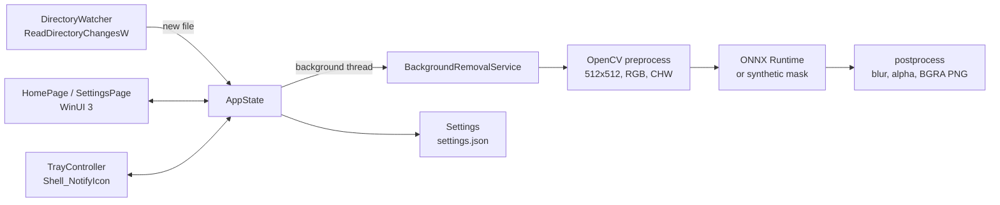

# BackgroundRemover

[](https://github.com/patelnet/rmbg-service/actions/workflows/ci.yml)
[](https://github.com/patelnet/rmbg-service/releases/latest)

A reproducible Windows desktop sample demonstrating an automatic
background-removal pipeline:

- **C++/WinRT + WinUI 3** (Windows App SDK) packaged desktop app
- **ONNX Runtime** inference (MODNet-style portrait matting)
- **OpenCV** pre/postprocessing
- **nlohmann::json** settings persistence
- Directory watching (`ReadDirectoryChangesW`), system tray control,
  drag-and-drop, and a WiX v5 MSI installer

Drop an image into the watched folder (or onto the app window) and a
transparent PNG appears in the output folder.

> **No ML model is included.** `models/modnet.onnx` is a placeholder; the
> app runs end-to-end with a deterministic synthetic mask until you supply
> a real model. See [`models/README.md`](models/README.md).

## Install (prebuilt MSI)

Grab `BackgroundRemover.msi` from the
[latest release](https://github.com/patelnet/rmbg-service/releases/latest)
and run it — per-user install, no admin elevation needed. Uninstall from
*Settings → Apps*. The MSI is unsigned; SmartScreen may prompt on first run.

To build from source instead, see [Quick start](#quick-start-core-pipeline--console-test).

## Pinned versions

| Dependency        | Version     | Pinned in            |
|-------------------|-------------|----------------------|
| ONNX Runtime      | 1.23.2      | `vcpkg.json`         |
| OpenCV            | 4.12.0      | `vcpkg.json`         |
| nlohmann-json     | 3.12.0      | `vcpkg.json`         |
| Windows App SDK   | 2.2.0       | VS project / NuGet   |
| CMake             | 3.30.2      | tested version       |
| vcpkg             | 2026.06.24  | `build.ps1`, CI      |
| WiX Toolset       | v5 (latest) | CI (`dotnet tool`)   |

> Note: the originally requested onnxruntime 1.17.0 / OpenCV 5.0.0 pins do
> not exist in the vcpkg 2026.06.24 registry (it provides onnxruntime
> 1.23.2 and OpenCV ≤ 4.12.0), so the nearest available versions are
> pinned. The code uses no version-specific APIs.

**Changing pins:** edit the `overrides` in `vcpkg.json`, `$vcpkgTag` in
`build.ps1`, and `VCPKG_TAG` in `.github/workflows/ci.yml` together, then
let CI validate. **Reverting:** restore the previous values from git history
(`git log -p vcpkg.json`) — pins are the only thing that changes.

## Quick start (core pipeline + console test)

Assumptions: Windows 10/11 x64, Visual Studio 2026 Community Edition with
the *Desktop development with C++* workload, git, CMake ≥ 3.24 on PATH.

```powershell
git clone https://github.com/patelnet/rmbg-service.git
cd rmbg-service
.\build.ps1          # bootstraps vcpkg, installs deps, builds, runs test
```

`build.ps1` builds the UI-independent core (`rmbg_core` static lib) and the
console smoke test. First run takes a while — vcpkg builds OpenCV and ONNX
Runtime from source.

### Console test manually

```powershell
.\build\Release\rmbg_console_test.exe assets\sample.jpg
# [PASS] Pipeline produced a valid transparent PNG.
```

## Building the WinUI 3 app (Visual Studio 2026)

The XAML app (`src/*.xaml*`) targets Windows App SDK **2.2.0** and is built
from Visual Studio (XAML compilation and MSIX packaging are VS/MSBuild
driven; the CMake project intentionally covers only the core + tests):

1. Install the **Windows App SDK 2.2.0** VS components (Windows application
   development workload) or add the `Microsoft.WindowsAppSDK` **2.2.0**
   NuGet package.
2. Create a *Blank App, Packaged (WinUI 3 in Desktop)* C++/WinRT project
   named **BackgroundRemover** and add the files from `src/` (replace the
   template's App/MainWindow). Define `BACKGROUNDREMOVER_WINUI` in the
   project's preprocessor definitions.
3. Point VS at the same vcpkg install (Project → vcpkg, or add include/lib
   paths from `vcpkg_installed\x64-windows`).
4. Build x64 Debug/Release and F5.

## Architecture



- **Threading:** watcher events and inference run on background threads;
  every UI update is marshaled with `DispatcherQueue.TryEnqueue`.
- **Safety:** outputs are named `<name>_nobg_<timestamp>.png` and never
  overwrite existing files (a numeric suffix disambiguates collisions).
- **Fallback:** a missing/invalid model activates a deterministic synthetic
  mask (soft centered ellipse) so tests and demos always work.
- **Settings:** `%LOCALAPPDATA%\BackgroundRemover\settings.json`, loaded at
  startup, saved on every change (write-temp-then-swap).

## Installer (WiX v5)

```powershell
dotnet tool install --global wix --version 5.0.2
wix build installer\Product.wxs -d BuildDir=build\Release -o build\BackgroundRemover.msi
```

- Per-user install (no admin elevation) to
  `%LOCALAPPDATA%\Programs\BackgroundRemover`
- Start Menu shortcut + Add/Remove Programs entry
- Major upgrades supported via a fixed `UpgradeCode`
- Never touches existing `settings.json` (the app creates it on first run)
- Optional runtime-chaining bundle in `installer/Bundle.wxs`
- **Signing (optional):** `signtool sign /fd SHA256 /a /tr
  http://timestamp.digicert.com build\BackgroundRemover.msi`. In CI, set the
  `ENABLE_SIGNING` repo variable and the `SIGNING_CERT_PFX_BASE64` /
  `SIGNING_CERT_PASSWORD` secrets.

## CI

`.github/workflows/ci.yml` (windows-latest): pinned-vcpkg bootstrap →
manifest install → CMake Release build → console test (synthetic fallback)
→ WiX MSI → artifact upload → optional signing.

## Troubleshooting

| Symptom | Fix |
|---|---|
| `VCPKG_ROOT is not set` / toolchain not found | Set `VCPKG_ROOT` to your vcpkg checkout, or just run `.\build.ps1` which bootstraps a local copy. |
| vcpkg version-override errors | Run `vcpkg x-update-baseline` in the repo root (aligns `builtin-baseline` with your vcpkg checkout). Overridden versions must exist in that checkout's registry — update the vcpkg tag if not. |
| First build extremely slow | Expected: OpenCV + ONNX Runtime compile from source. Enable the binary cache (`VCPKG_DEFAULT_BINARY_CACHE`) or reuse CI's cache key. |
| `onnxruntime` CMake target not found | Confirm the vcpkg toolchain file is passed and `vcpkg install` succeeded; check `vcpkg_installed\x64-windows\share\onnxruntime`. |
| WinUI app fails to start (`COMException`, missing runtime) | Install the Windows App SDK **2.2.0** runtime, or self-contain: `<WindowsAppSDKSelfContained>true</WindowsAppSDKSelfContained>`. |
| XAML `InitializeComponent` unresolved | Build once so `*.xaml.g.h` files generate; ensure each XAML file's `x:Class` matches its code-behind namespace exactly. |
| Model loads but output is garbage | Verify the model contract: `1×3×512×512` float32 RGB in, `1×1×512×512` matte out. See `models/README.md`. |
| Nothing happens for files copied into the watch folder | Large files may still be mid-copy; the service retries for ~3 s. Non-image files are skipped (see the in-app log). |
| Tray icon disappears after Explorer restart | Known Win32 limitation of the sample; restart the app (production apps re-add on `TaskbarCreated`). |

## Repository layout

```
├── README.md               ├── src/                      # app + core sources
├── vcpkg.json              │   ├── App.xaml(.h/.cpp)     # startup wiring
├── CMakeLists.txt          │   ├── MainWindow.xaml(...)  # NavigationView shell
├── build.ps1               │   ├── HomePage.xaml(...)    # controls, log, drag-drop
├── .github/workflows/      │   ├── SettingsPage.xaml(...)
│   └── ci.yml              │   ├── AppState.*            # orchestration
├── installer/              │   ├── DirectoryWatcher.*    # ReadDirectoryChangesW
│   ├── Product.wxs         │   ├── BackgroundRemovalService.*  # CV + ORT pipeline
│   ├── Bundle.wxs          │   ├── TrayController.*      # tray icon + menu
│   ├── LICENSE.txt         │   ├── Settings.*            # JSON persistence
│   └── icons/              │   └── pch.h/.cpp
├── models/                 ├── tests/
│   ├── modnet.onnx (stub)  │   └── console_test.cpp      # CI smoke test
│   └── README.md           └── assets/                   # appicon.ico, sample.jpg
```

## License

MIT — see [`installer/LICENSE.txt`](installer/LICENSE.txt). Third-party
dependencies and any downloaded model have their own licenses.
